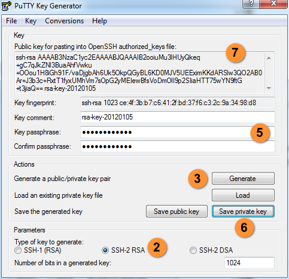

# Public Keys

You can provide your ssh pubkey and GPG key here.

If you have any problem or suggestion, contact or join us:
- 
- Base64: `aHR0cHM6Ly90Lm1lL2pvaW5jaGF0L0JPLWx1RkFMdFFnSDNQWE1zcGR3Q2c=`

## Why we need keys

SSH public keys can be easily added on the server.

GPG public keys can be used to verify files, encrypt or decrypt something after mutual trusted.

## How to generate ssh keys

For Windows user, you can download the PuTTY Client.

> [Download PuTTY](https://www.chiark.greenend.org.uk/~sgtatham/putty/latest.html)

For Linux/Unix Like User, you can install openssh for your system by package manager. THen exec `ssh-keygen` command.

After you get ssh keys you can [commit your public key here](authorized_keys). **Do not move or modify a public key that does not belong to you.**

## How to generate GPG keys

For Linux/Unix Like User, you can install gnupg for your system by package manager. Then exec `gpg --gen-key` command. Also you can use GUI Applications to finished it.

- [gpg4win](https://www.gpg4win.org/)
- [kleoptra](https://www.kde.org/applications/utilities/kleopatra/)
- [gpgs](https://gpgtools.org/)

Publish the public key to server.

> [USTC GPG Server](https://pgp.ustc.edu.cn/)

As the same you can [commit your gpg key finger here](gpg_keys) after it published on server.

Add GPG keys for [Github](https://github.com/settings/keys) to verify the committing.